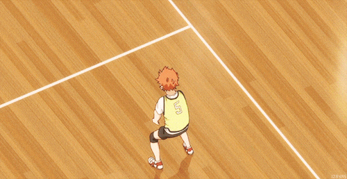

  <kbd>
    
  </kbd>

  

 

<table>
  <tr>
    <td width="60%" valign="top">
      <h3> > BRINGING IMAGINATION TO LIFE, ONE PIXEL AT A TIME</h3>
      <blockquote>
        "Ever since that night, I learned something... people can stand beside you and still never see <b>what’s inside you.</b>  
        They talk about pain like a story, like they can understand. But they weren’t there. They didn’t lose everything in one moment, so I stopped trying to make them know.  
        <b>My path. My choices. My hatred.</b> 
        They were never meant for anyone else to carry. I realized the world only listens when you become strong enough to <i>force</i> it to.  
        I don’t need them to understand me. I just need to reach the end of the path I decided—<b>no matter what it takes.</b>"
      </blockquote>
    </td>
    <td width="40%" valign="center">
      

        
      

    </td>
  </tr>
</table>

  <table width="100%" style="border: none;">
    <tr>
      <td width="33%" align="center" valign="top">
        <h3>WHO AM I</h3>
        
I am <b>Anurag Singh</b>. A 1st-Year B.Tech CSE Student obsessed with bringing <b>imagination to life</b>. I don't just write code; I build <b>new realities</b>.

      </td>
      <td width="33%" align="center" valign="top">
        <h3>LEARNINGS</h3>
        
Acquiring power in:

        

          <code>C++ & Unreal Engine</code> 
          <code>Game & Web Development</code> 
          <code>Blender 3D & AI</code>
        

      </td>
      <td width="33%" align="center" valign="top">
        <h3>WHAT YOU GET</h3>
        
By following my path, you get:

        <ul align="left">
          <li>> Cool, Experimental Projects</li>
          <li>> Clear Learning Roadmaps</li>
          <li>> In-Depth Knowledge</li>
        </ul>
      </td>
    </tr>
  </table>

### > The Arsenal

  <kbd>
    
  </kbd>
  

    

  

### > Github Stats

  
 
 

  <kbd>
    
  </kbd>

### > The Cool Animations

  <kbd>
    
  </kbd>

  

  <kbd>
    
  </kbd>

### > Achievements

  

### > Top Contributed Repos

  <table style="border: none;">
    <tr>
      <td align="center" width="50%">
        
          
        
        
         
        
<i>The central database of my abilities.</i>

      </td>
      <td align="center" width="50%">
        
          
        
        
         
        
<i>50 Days. 50 Web Experiments.</i>

      </td>
    </tr>
  </table>

>

### > Connect with Me

  
  
  
  
  

### > Random Dev Quote

  

 

  <kbd>
    
  </kbd>

<aside>
  

  
  
  

</aside>
